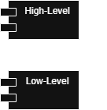
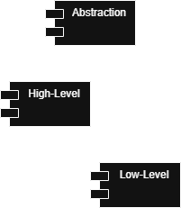

<!-- .slide: data-background-image="./title.png" data-background-opacity="0.3" -->

## The Alchemy of Code

### Turning Spaghetti into Gold

[Micha Sengotta](https://github.com/michasng)

Note:

- Welcome everyone
- The title is a metaphor: turning messy, tangled code into something clean and valuable
- This talk is about the principles behind that transformation — not magic, but craft

---

<!-- .slide: data-background-image="https://static01.nyt.com/images/2023/10/25/multimedia/25nightmare-anniv-01-tfvj/25nightmare-anniv-01-tfvj-videoSixteenByNineJumbo1600.jpg" data-background-opacity="0.3" -->

## What's this?

## What's this?

Note:

- What **is** or **isn't** this talk about?
- In one sentence, I want to explain the guiding principles to writing good software.
- I used to memorize **software design patterns**
  - Some can be **anti-patterns** (e.g. **Singletons** or **Service Locators**)
  - Now focus more on underlying **principles** and their **trade-offs**
  - Applied principles can lead to the accidental discovery of existing design patterns
  - Deeper understanding of **why** a solution is good or bad
- And that's why we will _mostly_ talk about **software design principles**
  - When to use them?
  - Trade-Offs?
  - Realistic examples, where I encourage active participation
- Also about **programming paradigms** and the so called **pillars of OOP**
  - Often mentioned in our coding interviews
  - I see a lot of misunderstandings surrounding those
  - Fundamental to writing good software
- My lists of paradigms and principles are not exhaustive
  - A selection that I found most relevant for my everyday work

---

## Linguistics

<div style="display: flex; flex-direction: column; align-items: stretch; width: 100%">
  <div style="background-color: #bb5500">
    <h3>Pragmatics (Context)</h3>
    <p style="line-height: 1">Why?</p>
    <p style="line-height: 1">Domain, Principles, Trade-Offs</p>
  </div>
  <div style="background-color: #993300">
    <h3>Semantics (Meaning)</h3>
    <p style="line-height: 1">What? How?</p>
    <p style="line-height: 1">Control Flow, Boolean Logic, State</p>
  </div>
  <div style="background-color: #771100">
    <h3>Syntax (Grammar)</h3>
    <p style="line-height: 1">Language Constructs</p>
  </div>
</div>

Note:

- Spent some time thinking about **how** we learn to program
- Programming languages are **formal languages**, we can use **linguistics** to understand them
- Some subfields of linguistics that we can picture as "layers" to describe languages
- **Syntax**
  - How we arrange words and phrases into coherent sentences
  - E.g. "The dog chased the cat" is correct, while "Chased the cat the dog" is not
  - Compiler/Interpreter can verify syntax without/before executing the program
  - **Hello World** - Writing code that executes at all is typically the first thing to learn
- **Semantics**
  - Whether a sentence makes any sense
  - E.g. "Colorless green ideas sleep furiously." is syntactically correct, but makes no sense semantically
  - In the same sense, I could write a program that runs, but doesn't do anything meaningful
  - To write semantically correct programs, I need to learn about **control flow**, **boolean logic** and **state**
  - The semantic possibilities of a language dictate which **programming paradigms** are best supported
    - Of course every **Turing Complete** language can simulate any paradigm
    - But some languages are semantically more tuned to certain paradigms
  - Semantics depend on syntax
    - E.g. I can only create objects in Java, because the Syntax allows me to define a class
- **Pragmatics**
  - The same semantically correct sentence might have totally **different meanings**, depending on the **context**
  - E.g. When a student asks the teacher "Can I go to the bathroom?" and the teacher replies "I don't know. Can you?"
    - The teacher **implies a different context**, where "can" relates to the ability rather than the permission.
  - It's the same in programming, where e.g. an `AppleProvider` might provide fruits or smartphones, depending on the context
    - **Domain Driven Design** tells us to use **Ubiquitous Language**:
      Using the vocabulary of the domain within the code
  - pragmatic considerations to design a system
    - many ways to solve the same problem, not all solutions are equally pragmatic
    - This is going to be the main focus of this talk

---

## Paradigms

Note:

- What is a paradigm?
  - Exists in many contexts, outside of programming, e.g. philosophy
  - Here: "a high-level approach to conceptualize and structure the implementation of a program"

--

declarative\
imperative\
procedural\
functional\
object oriented\
event driven\
reactive\
meta\
generic\
...

Note:

- There are many paradigms — this list is not exhaustive
- Most modern languages are **multi-paradigm**: they support several of these at once
- We'll focus on the most prevalent ones

--

## Declarative vs. Imperative

Good vs. bad?

Note:

- people talk about this a lot
- the common advice is to favor "declarative code over imperative code"
- people tend to use "declarative" as a synonym for "good"
- but is it really black-and-white?
- how do these paradigms relate to other paradigms?

--

### Grammatical moods

declarative / indicative facts

> It _is_ warm.

imperative commands

> _Do_ turn up the heat!

Note:

- Grammatical mood
  - DE: Modus
  - A feature of verbs to express "modality" / the attitude of the speaker toward what they are saying
- Declarative mood
  - DE: Indikativ, Wirklichkeitsform
  - to describe reality
  - neutral statements of fact
- Imperative mood
  - DE: Imperativ, Befehlsform
  - to give commands

--

### Declarative

```sql
SELECT name
FROM   people
WHERE  LENGTH(name) < 6;
```

### Imperative

```typescript
const shortNames: string[] = [];
for (let i = 0; i < people.length; i++) {
  if (people[i].name.length < 6) {
    shortNames.push(people[i].name);
  }
}
```

Note:

- so, in both cases we "declare" something
- declarative
  - declare the desired result, the data source and some constraints
  - we don't declare how it is computed
  - we don't care about control flow or state changes
- imperative
  - declare the specific control flow and state changes
  - we are aware that statements will be executed in a specific order every time
- this is what people mean, when they say
  - declarative describes "what"
  - imperative describes "how"

--

### 🥸 Man vs. Machine 🤖

Machine code / assembly is imperative:

> Move this data here.\
> Then add these values.

Humans can do both, but steps are often implied:

> I need coffee.\
> (boil water, grid beans, ...)

Note:

- Imperative is closer to machine language
  - so it's easier to debug the specific steps
  - and it allows for fine-grained optimizations
- Declarative has a higher level of abstraction
  - implementation details are hidden
  - there is less to worry about, so it tends to be more readable and maintainable
- It's a trade-off, but in many cases, the benefits of declarative code outweigh the downsides

--

<h2 class="fragment custom blur">Procedural (Imperative)</h2>

```typescript
function findShortNames(people: Person[]) {
  const shortNames: string[] = [];
  for (const person of people) {
    if (isShort(person.name)) {
      shortNames.push(person.name);
    }
  }
  return shortNames;
}
```

Note:

- What paradigm would it be, if I put imperative code in a function?
  - It's procedural programming
- Despite the "function" keyword, it's called procedural programming, not necessarily functional
- Sometimes they're called "procedures", other times "functions" or "subroutines"
- the essence is re-usable code that calls other re-usable code
  - at runtime, this is typically represented by a call stack
  - an entire program could be represented by a call tree
- a person in this example is a "record"
  - that's a combound data type, made up of a fixed set of fields
  - that's the procedural term for an object
  - so you don't necessarily need OOP in order to have something like an object, more on that later

--

## Functional (Declarative)

<!-- prettier-ignore -->
```typescript
const isShort = (name: string) => name.length < 6;

const shortNames = people
  .map(person => person.name)
  .filter(isShort);
```

Note:

- Functional programming is similar to procedural programming, but without the imperative elements
- the program still forms a call tree
- there is no mutable state
- functions are "first-class citizens"
  - they can be assigned to variables, passed around as arguments and be returned by other functions
- relies on pure functions (also called "purely functional programming")
  - deterministic
    <!-- - the same arguments always leads to the same return value -->
  - no side-effects
    <!-- - the only thing it does is to determine the return value based on the arguments -->
    <!-- - it doesn't modify non-local variables or perform I/O operations -->
  - "same thing in, same thing out" and that's all it does
- functional programming eliminates the possibility of some **bugs**
and having no state makes it arguably easier to **debug** and **test** and
<!-- - roots in academia, comes from "lambda calculus", a system of computation based only on functions -->
- It's declarative in the sense that we don't explicitly state when and how the runtime iterates and when a condition executes.
- Of course, the runtime still has to these things.
- So, in the case of JavaScript, these array functions are not lazily evaluated.
  - `map` returns another array
  - So from a performance standpoint, it's not ideal that we `filter` after the entire array is mapped.
  - Ideally, the API would evaluate lazily and then the order of our declarations would make less of a difference.
  - because that's the point of declarative programming: To not have to think about the concrete steps

--

## Object Oriented (Mixed)

```typescript
class Group {
  constructor(private people: Person[]) {}

  getShortNames(): string[] {
    return this.people
      .filter((person) => person.hasShortName())
      .map((person) => person.name);
  }
}
```

Note:

- Object orientation divides a program into objects
- Objects expose data and behavior through defined interfaces
  - We call them "members"
  - The data is also called "fields", "attributes" or "properties"
  - And the behavior or functions are now called "methods"
- The difference to procedural programming is that data and behavior are no longer separate -> they are bundled in objects

---

<!-- .slide: data-background-image="https://static.vecteezy.com/system/resources/previews/056/884/821/non_2x/3d-ancient-greek-temple-with-columns-on-transparent-background-free-png.png" data-background-opacity="0.3" -->

## Four Pillars of OOP

Note:

- In OOP, people came up with features or "pillars" that a system should follow in order to call itself "object oriented"
- I specifically don't call them **principles** of OOP
- Because this is less about **you** than it is about the **system**
- However, it's still important to understand how the system works in order for you to know how you should use it

--

<!-- .slide: data-background-image="https://static.vecteezy.com/system/resources/previews/056/884/821/non_2x/3d-ancient-greek-temple-with-columns-on-transparent-background-free-png.png" data-background-opacity="0.1" -->

### Encapsulation

#### Information hiding

⬆️ Cohesion ⬆️

⬇️ Coupling ⬇️

Note:

- "Encapsulation" or sometimes "Information Hiding"
- Several related concepts with fuzzy borders
- Idea:
  - Bundling related members in one unit (object),
    - Benefit of high cohesion: Things that belong together are in the same place
  - Restricting access to members through defined interfaces
    - Benefit of low coupling: Fewer interdependencies between modules
    - Helps prevent incorrect or inconsistent states at runtime

--

### Abstraction

abstrahere: to remove

```typescript
abstract class Animal {
  abstract speak(): string;
}
```

Note:

- The term abstraction comes from latin and means "to draw away" / "to remove"
- It's typically used as viewing a concept or idea detached from specific instances or physical objects
- The real world is complex, but not all of this complexity is relevant to the goal of the software
- Abstraction simplifies complexity by modeling only the essentials
- Unnecessary details are disregarded
- Thinking back to "declarative" and "imperative" paradigms:
  - Abstraction separates **what** something does from **how** it is implemented
  - e.g. abstract classes or interfaces
  - **what** the abstract method does is not defined by **how** it's implemented

--

### Inheritance

hierarchical reuse of code

Note:

- Hierarchical tree-structures that enable implementation sharing / code reuse
- Can be implemented via prototypes or classes
- Prototypes
  - Inheritance on the level of objects
  - An object can be linked to another object, called parent or prototype
  - Up to the "base" object, which has no prototype
    <!-- - Every object -->
      <!-- - Inherits the properties of it's prototype -->
      <!-- - Can define additional properties -->
    <!-- - Optional -->
      <!-- - Multiple inheritance allows having multiple prototypes -->
- Classes
  - Most common approach
  - Inheritance on the level of classes
  - Classes are templates / blueprints
  - Class instance = object
  - I'm sure you know the rest of it
    <!-- - Class member = attribute or method -->
    <!-- - (sub / child) classes can inherit / be derived from) other (super / parent / base) classes -->
    <!-- - An instance of a subclass is also a member of every super-class, sharing the same attributes and methods -->
    <!-- - Optional -->
      <!-- - Subclass members can override super-class members -->
      <!-- - Static members are class-specific instead of instance-specific -->
      <!-- - Multiple inheritance allows having multiple direct super-classes -->
      <!-- - Additional constructs like mixins, traits or interfaces -->
- What I want you to take away is that classes are not strictly necessary for inheritance, as long as hierarchical reuse of code is possible in some way

--

### Polymorphism

subtype\
ad hoc\
parametric\
coercion

Note:

- There are different kinds of polymorphism
- People often get them confused
  - I often participate in our TNG interviews
  - Few people really seem to understand this concept, or they give a textbook definition verbatim
- Polymorphism generally means "having multiple types"
- In the context of OOP, we typically mean "subtype polymorphism"

--

### Subtype Polymorphism

```typescript
abstract class Animal {
  abstract speak(): string
}

class Dog extends Animal {
  override speak(): string {
    return "Woof!";
  }
}

class Cat extends Animal {
  ...
```

Note:

- AKA "inclusion polymorphism" or "method overriding"
- Using inheritance OR interfaces
- A reference to a super-type can refer to any derived type
- A subtype (`Dog`) can provide a specific implementation for a method defined by its super-type (`Animal`)
- Control flow is determined at runtime (AKA dynamic / late binding)
- Which method is called, depends on the type of the object itself (not on the parameter types)
- Remember to apply the Liskov Substitution Principle (LSP)! (presented later)

--

### Other Polymorphism

#### Ad hoc (Overloading)

<!-- prettier-ignore -->
```typescript
class Dog {
  speak(sound: string): string;
  speak(times: number): string;
  speak(arg: string | number): string {
    const [sound, times] = typeof arg === "string"
      ?  [arg, 3] : ["Woof! ", arg];
    return sound.repeat(times).trim();
  }
}
```

#### Parametric (Generics)

```typescript
interface Factory<T> { T create(); }
```

#### Coercion (Weak Typing)

```javascript
"a" + 1; // "a1"
```

Note:

- Ad hoc polymorphism
  - A function can have multiple implementations with different signatures, specifically parameter types
  - AKA function or operator overloading
  - Control flow is typically determined at compile time (AKA static / early binding)
    - There are exceptions (interpreted languages, Julia, Common Lisp) where control flow is determined at runtime, based on the actual parameter types
  - TypeScript is forced to implement this in a weird way, because here you can overload signatures, but all of them share a single implementation
    - Other languages like Java allow you to declare independent methods with the same name
- Parametric polymorphism
  - Declarations using "generic" instead of "concrete" types
  - Abstract symbols that can substitute for any type
  - Generic programming (AKA "templates" in C++)
  - Typically checked at compile time
  - Different approaches, depending on the language
    - Monomorphization - compilation generates type-specific code (e.g. Rust, C++, C# at runtime for value types)
    - Type erasure - compilation discards type information or the runtime uses dynamic typing (e.g. Java using "Boxing" for value types, C# for reference types, TypeScript, Python)
- Coercion polymorphism
  - This happens when a language automatically converts a value from one type to another to match a function's (or operator's) requirements
  - AKA implicit type conversion or "weak" typing
  - Other example: Passing an int to a function expecting a float

--

<!-- .slide: data-background-image="https://static.vecteezy.com/system/resources/previews/056/884/821/non_2x/3d-ancient-greek-temple-with-columns-on-transparent-background-free-png.png" data-background-opacity="0.1" -->

Encapsulation\
Abstraction\
Inheritance\
Polymorphism

Note:

- So, just to recap, these are the four pillars.

---

## SOLID Principles

Note:

- Now we'll talk about actionable principles for developers
- You can actually apply these to make your code more understandable, flexible and maintainable
- SOLID principles relate specifically to OOP and functional programming
- Introduced by Robert C. Martin ("Uncle Bob")
  - This is the author of "Clean Code"
  - And one of the authors of the Agile Manifesto

--

#### Violation of ?

```typescript
class UserService {
  constructor(private userRepository: Repository<User>) {}

  saveUser(user: User): void {
    this.userRepository.save(user);
    this.logInfo(`User ${user.name} stored`);
  }

  private logInfo(message: string): void {
    const time = new Date().toISOString();
    const origin = UserService.name;
    console.info(`${time} in ${origin}: ${message}`);
  }
}
```

Note:

- Question: What is the violation?
- This service does too many things
  - It calls some `Repository`, so far so good
  - But it also decides exactly how the log messages are formatted
- You can imagine how this is going to lead to duplicate and inconsistent code over time

--

### Single Responsibility Principle

> There should never be more than\
> one reason for a class to change.

Note:

- There should never be more than one reason for a class to change
- I.e. every class should have only one responsibility
- The OOP implementation of "Separation of Concerns (SoC)"
- How?
  - Write small classes with only one job
- Why?
  - Makes your classes easy to think about and change
  - Also makes them easy to unit-test in isolation

--

#### Application

of the Single Responsibility Principle

```typescript
class UserService {
  constructor(
    private logger: Logger,
    private userRepository: Repository<User>,
  ) {}

  saveUser(user: User): void {
    this.userRepository.save(user);
    this.logger.info(`User ${user.name} stored`);
  }
}
```

Note:

- A `Logger` class has been extracted
- Now the service only has one responsibility, which is to manage users

--

#### Violation of ?

```typescript
class TotalAreaCalculator {
  calculate(shapes: Array<Rectangle | Circle>): number {
    return shapes.reduce((sum, shape) => {
      if (shape instanceof Rectangle) {
        return sum + shape.width * shape.height;
      } else if (shape instanceof Circle) {
        return sum + Math.PI * shape.radius ** 2;
      }
      throw new Error("Unknown shape");
    }, 0);
  }
}
```

Note:

- Question: What is the violation?
- Adding another type of shape requires that we modify the existing code
  - Say we wanted to offer this as a library, there would be no simple way to extend this
- Single Responsibility is also violated

--

### Open/Closed Principle

> Software entities should be\
> open for extension,\
> but closed for modification.

Note:

- Software entities should be open for extension, but closed for modification
- What's a software entity? → classes, modules, functions
- Adding features without modifying existing code
- How?
  - Apply the Single Responsibility Principle
  - Use composition ("has a" relationships)
  - Avoid runtime type checks ("instance of" code-smell)
- Why?
  - Makes code flexible and re-usable
  - Reduces the risk of breaking things from modification
  - Moves errors from runtime to compile time

--

#### Application

of the Open/Closed Principle

```typescript
interface Shape {
  area(): number;
}

class TotalAreaCalculator {
  calculate(shapes: Shape[]): number {
    return shapes.reduce((sum, shape) => sum + shape.area(), 0);
  }
}
```

Note:

- This can fail at compile time, but it shouldn't fail at runtime

--

#### Violation of ?

<!-- prettier-ignore -->
```typescript
class Stack {
  private _items: number[] = [];

  push(item: number): void { this._items.push(item); }
  pop(): number | undefined { return this._items.pop(); }
  peek(): number | undefined { return this._items.at(-1); }
}
```

```typescript
class ReadOnlyStack extends Stack {
  push(_item: number): void {
    throw new Error("Cannot push onto a read-only stack");
  }
  pop(): number | undefined {
    throw new Error("Cannot pop from a read-only stack");
  }
}
```

```typescript
function transferTop(from: Stack, to: Stack): void {
  const top = from.pop();
  if (top !== undefined) to.push(top);
}
```

Note:

- Question: What is the violation?
- `ReadOnlyStack` violates the contract of `Stack` — callers expect `push` and `pop` to always work
- This example is inspired by real code from the standard libraries of C# and Dart

--

### Liskov Substitution Principle

> Objects of a superclass\
> should be replaceable\
> with objects of its subclasses\
> without breaking the application.

Note:

- Objects of a superclass should be replaceable with objects of its subclasses without breaking the application.
- I.e. any derived type can "substitute" their base types and the program is still correct.
- A subclass should never break the constract of the superclass
- How?
  - Use composition ("has a") instead of inheritance ("is a")
  - Avoid "Unsupported exception" code-smell
  - Apply the Interface Segregation Principle (next up)
- Why?
  - Makes contracts reliable
  - Enables subtype polymorphism
  - Avoid runtime issues

--

#### Application

of the Liskov Substitution Principle

<!-- prettier-ignore -->
```typescript
class Stack {
  private _items: number[] = [];

  push(item: number): void { this._items.push(item); }
  pop(): number | undefined { return this._items.pop(); }
  peek(): number | undefined { return this._items.at(-1); }
}
```

<!-- prettier-ignore -->
```typescript
class ReadOnlyStack {
  constructor(private inner: Stack) {}

  peek(): number | undefined { return this.inner.peek(); }
}
```

```typescript
function transferTop(from: Stack, to: Stack): void {
  const top = from.pop();
  if (top !== undefined) to.push(top);
}
```

Note:

- `ReadOnlyStack` now _wraps_ a `Stack` instead of extending it
- It is no longer a subtype of `Stack`, so `transferTop` can never receive it
- The contract of `Stack` is never broken

--

#### Violation of ?

```typescript
interface Stack {
  push(item: number): void;
  pop(): number | undefined;
  peek(): number | undefined;
}

function printTop(stack: Stack): void {
  console.log(stack.peek());
}
```

```typescript
class ReadOnlyStack {
  peek(): number | undefined { ... }
}

printTop(new ReadOnlyStack());
```

Note:

- `printTop` only ever calls `peek()` — it never pushes or pops
- But it is forced to depend on the full `Stack` interface
- A `ReadOnlyStack` that only implements `peek` cannot be passed here
- This means we either must add dummy/throwing implementations of `push`/`pop`,
  or we cannot use `printTop` with read-only stacks

--

### Interface Segregation Principle

> Clients should not be forced to depend on methods they do not use.

Note:

- Clients should not be forced to depend upon interface methods that they do not use
- Many specific interfaces are better than one general-purpose interface
- How?
  - Split large interfaces
- Why?
  - Decoupling: Fewer dependencies between modules
    - Gives you less to think about
    - Simplifies mocking in unit-tests

--

#### Application

of the Interface Segregation Principle

```typescript
interface ReadableStack {
  peek(): number | undefined
}

interface WritableStack {
  push(item: number): void
  pop(): number | undefined
}

class Stack implements ReadableStack, WritableStack { ... }

class ReadOnlyStack implements ReadableStack { ... }
```

```typescript
function printTop(stack: ReadableStack): void {
  console.log(stack.peek());
}
```

Note:

- `printTop` now depends only on `ReadableStack` — exactly what it needs
- `ReadOnlyStack` implements only `ReadableStack`, so it can now be passed to `printTop`
- `transferTop` would accept `WritableStack`, keeping the two concerns cleanly separated

--

#### Violation of ?

```typescript
// low-level module
class InMemoryUserRepository {
  save(data: User): void;
}

// high-level module
class UserService {
  constructor(private storage: InMemoryUserRepository) {}

  // ...
}
```

Note:

- Question: What is the violation?
- A high-level module depends on a low-level module
  - Both are concretions

--

<!-- .slide: data-transition="slide-in fade-out" -->

### Dependency Inversion Principle

> High-level modules shouldn't\
> depend on low-level modules.\
> Both should depend on abstractions.



Note:

- High-level modules shouldn't depend on low-level modules; Both should depend on abstractions
- So instead of doing this ...

--

<!-- .slide: data-transition="fade-in slide-out" -->

### Dependency Inversion Principle

> High-level modules shouldn't\
> depend on low-level modules.\
> Both should depend on abstractions.



Note:

- ... we should do this
- Where both modules depend on abstractions, not on each other
- How?
  - Depend on abstractions, not on concretions
  - We have different kinds of arrows here
    - The high-level module "uses" the abstraction
    - And the low-level module "realizes" the abstraction; It is a concrete implementation of the abstraction
- Why?
  - Loose coupling
  - Flexibility: Implementations are interchangeable
  - Makes code more declarative
    - The high level module is only concerned about "what" happens, without needing to care about "how" it's implemented
  - That's also a clearer Separation of Concerns
- Careful with the word "inversion" in this context
  - What we invert is the dependency hierarchy
    - Before, we had an arrow pointing down
    - Now we have two arrows pointing up
  - This is not the same "inversion" as in the "Inversion of Control" principle
    - We will talk about this later

--

#### Application

of the Dependency Inversion Principle

```typescript
// abstraction
interface Repository<T> {
  save(data: T): void;
}

// low-level module
class InMemoryUserRepository implements Repository<User> {
  save(data: User): void;
}

// high-level module
class UserService {
  constructor(private repository: Repository<User>) {}
}
```

Note:

- We introduce a `Repository` abstraction
- Both of our concrete classes depend on the abstraction, but in different ways
  - The high-level service uses the abstraction
  - The low-level `InMemoryRepository` realizes the abstraction
    - It is one among many possible `Repository` implementations
- These two classes are now decoupled

--

## SOLID Principles

- Single Responsibility Principle (SRP)
- Open/Closed Principle (OCP)
- Liskov Substitution Principle (LSP)
- Interface Segregation Principle (ISP)
- Dependency Inversion Principle (DIP)

note:
- recap: These are the SOLID principles

---

## Design Principles

Note:

- These principles are broader than SOLID — they apply across paradigms and at different levels of abstraction
- Some overlap with SOLID; we'll see how they complement each other
- Same format: violation first, explanation, then application

--

#### Violation of ?

```typescript
class OrderService {
  private repository = new PostgresRepository<Order>();
  private mailer = new SmtpMailer();

  placeOrder(order: Order): void {
    this.repository.save(order);
    this.mailer.send(`Order ${order.id} confirmed`);
  }
}
```

Note:

- `OrderService` calls `new` itself — it controls which implementations to create
- To use a different repository or mailer, you must modify `OrderService`
- Impossible to swap implementations for testing

--

### Inversion of Control

> Don't call us, we'll call you.

Note:

- Also known as the **Hollywood Principle**
- Traditional flow: your code controls everything — it decides which implementations to create and when to call them
- Inverted flow: control over instantiation and lifecycle is handed to an external caller
- Common implementations:
  - **Dependency Injection** — dependencies are provided from the outside
  - Callbacks and event listeners — the framework calls your function
  - Template Method pattern — the base class controls the flow, subclasses fill in steps
- Recall DIP: DIP is about _what_ you depend on (abstractions)
  - IoC is about _who controls_ instantiation and flow (the caller, not the class)
- Why?
  - Decouples components from their dependencies
  - Implementations become easy to swap — e.g. for testing

--

#### Application

of Inversion of Control

```typescript
class OrderService {
  constructor(
    private repository: Repository<Order>,
    private mailer: Mailer,
  ) {}

  placeOrder(order: Order): void {
    this.repository.save(order);
    this.mailer.send(`Order ${order.id} confirmed`);
  }
}
```

<!-- prettier-ignore -->
```typescript
const service = new OrderService(
  new PostgresRepository(),
  new SmtpMailer(),
);
```

Note:

- `OrderService` no longer calls `new` — it just declares what it needs
- The caller decides which implementations to provide
- Swapping to a mock mailer in tests requires no changes to `OrderService`
- This specific form of IoC is called **Dependency Injection (DI)**

--

#### Violation of ?

```html
<button
  style="color: white; background: blue; padding: 8px 16px;"
  onclick="window.location.href = '/page2';"
>
  Next page
</button>
```

Note:

- Three concerns are tangled in one element:
  - **Structure**: what the element is (HTML)
  - **Presentation**: how it looks (inline `style`)
  - **Behavior**: what it does (inline `onclick`)
- Nobody can change the styling or behavior without searching through the markup
- No classes involved — SoC is a concern regardless of paradigm

--

### Separation of Concerns

> A program should be divided\
> into distinct sections,\
> each addressing a separate concern.

Note:

- Coined by Edsger Dijkstra in 1974
- A "concern" is any distinct aspect of a system: structure, presentation, behavior, persistence, validation, logging, …
- SoC is the **general principle** — it applies at every level and in every paradigm
  - Architecture: MVC, layered services, microservices
  - Modules and files: HTML vs. CSS vs. JS
  - Classes: each class has one job → that's the **Single Responsibility Principle**
    - SRP is the OOP-specific application of SoC
- How?
  - Group code by what it is _about_
- Why?
  - Each section can be understood, tested and changed in isolation
  - A change in one concern doesn't ripple into unrelated code

--

#### Application

of Separation of Concerns

```html
<!-- HTML: structure -->
<button class="next">Next page</button>
```

```css
/* CSS: presentation */
.next {
  color: white;
  background: blue;
  padding: 8px 16px;
}
```

```javascript
// JavaScript: behavior
document.querySelector(".next").addEventListener("click", () => {
  window.location.href = "/page2";
});
```

Note:

- Structure, presentation and behavior now live in separate files
- A designer can restyle the button without touching any JavaScript
- A developer can change the behavior without opening the HTML
- Each file has a single, well-defined concern

--

#### Violation of ?

```typescript
interface Effect { apply(player: Player): void; }
class HealthEffect implements Effect { ... }
class StrengthEffect implements Effect { ... }

class EpicPotionEffect extends HealthEffect, StrengthEffect {
  ...
}
```

Note:

- Question: What is the violation?
- Multiple inheritance, Diamond Problem
  - A class tries to inherit from multiple other classes
  - TypeScript refuses compile: "Classes can only extend a single class."

--

### Composition over Inheritance

> Achieve polymorphic behavior\
> and code reuse\
> by composing objects rather than\
> inheriting from a root class.

Note:

- There are two kinds of relationships between objects
  - Inheritance models "is a" relationships (when adhering to the Liskov Substitution Principle)
  - Composition models "has a" relationships
- Both composition and inheritance enable code reuse
- How?
  - Write small classes (follow the Single Responsibility Principle)
  - Use interfaces
  - Assign components instead of inheriting from them
  - Use Decorator and Composite patterns
- Why?
  - Inheritance hierarchies can get complex via their depth
    - Metric: Depth of Inheritance Tree (DIT)
  - Inheritance is static at compile time, composition is dynamic at runtime
    - Composition is more flexible: Even at runtime
  - It reduces coupling
    - Inheritance creates "high coupling" (concrete base class)
    - Composition creates "low coupling" (abstract components, interfaces)
  - Inheritance creates friction, contracts often need to change
  - Inheritance can hide dependencies
    - Always consider not just this class, but also the parent class
  - Inheritance makes it easy to violate the Single Responsibility Principle

--

#### Application

of Composition over Inheritance

```typescript
interface Effect { apply(player: Player): void; }
class HealthEffect implements Effect { ... }
class StrengthEffect implements Effect { ... }

class CompositeEffect implements Effect {
  constructor(private effects: Effect[]) {}

  apply(player: Player): void {
    for (const effect of this.effects) { effect.apply(player); }
  }
}
```

```typescript
const epicPotionEffect = new CompositeEffect([
  new HealthEffect(),
  new StrengthEffect(),
]);
```

Note:

- Using re-usable parts
- This might take some more boilerplate and "glue-code"
  - But declarations are easy to think about and quick to change
  - This is still a good trade-off to make

--

#### Violation of ?

```typescript
class FileWriter {
  open(path: string): FileHandle;
  write(handle: FileHandle, bytes: Uint8Array): void;
  flush(handle: FileHandle): void;
  close(handle: FileHandle): void;
}
```

Note:

- Every caller must manually manage open/flush/close
- Implementation details leak into the interface

--

### Deep Modules

> The best modules are those\
> that provide powerful functionality\
> yet have simple interfaces.

Note:

- Concept by John Ousterhout, from "A Philosophy of Software Design"
- A module's **depth** is the ratio of functionality to interface complexity
  - **Deep module**: simple interface, lots of hidden complexity (e.g. a file system, a garbage collector)
  - **Shallow module**: complex interface relative to the functionality it provides
- Interface complexity = the cognitive load it places on callers
  - Not just the number of methods, but also parameters, side-effects, preconditions
- Goal: maximize what a module does for you while minimizing what you need to know to use it
- How?
  - Hide implementation details behind clean interfaces
  - Prefer fewer, more powerful methods over many narrow ones
  - Apply information hiding (Encapsulation)
- Why?
  - Reduces cognitive load for callers
  - Localizes complexity: changes stay inside the module
  - Shallow modules are often a sign of over-decomposition (too many tiny classes)

--

#### Application

of Deep Modules

```typescript
class FileWriter {
  write(path: string, content: string): void;
}
```

Note:

- Callers only express intent: "write this content to this path"
- All open/flush/close complexity is hidden inside
- Of course, the deep version is less flexible — sometimes you need the shallow API
  - The key is to match the interface to the typical use-case and hide the rest
  - Use composition to wrap low-level APIs

--

#### Violation of ?

```typescript
// reaching through a chain of objects
const city = order.getCustomer().getAddress().getCity();
```

Note:

- The chain `order → customer → address → city` means the caller knows about three layers of internal structure
- If `Address` ever changes (e.g. `getCity()` becomes `city`), every call-site breaks

--

### Law of Demeter

> A module should not know\
> about the internal details\
> of the objects it manipulates.

Note:

- Also called the **Principle of Least Knowledge**
- Colloquially: "Don't talk to strangers"
- Formulated at Northeastern University (Boston, Massachusetts) in 1987 during the Demeter project
- A method `m` of object `O` should only call methods on:
  - `O` itself
  - Objects passed as arguments to `m`
  - Objects created inside `m`
  - Direct fields of `O`
- How?
  - Avoid chaining calls into objects you don't directly own
  - Expose higher-level operations instead of exposing internals
- Why?
  - Reduces coupling: a caller shouldn't depend on the internal structure of its dependencies
  - Changes to internal structure don't cascade outward
  - Code is easier to test and reason about

--

#### Application

of the Law of Demeter

```typescript
// expose only what callers need
const city = order.getCustomerCity();
```

Note:

- By delegating through `order.getCustomerCity()`, callers are shielded from internal changes
- Note: fluent/builder APIs and functional pipelines (e.g. `array.filter(...).map(...)`) are not violations — the Law of Demeter applies to accessing _foreign_ object internals, not to chaining operations on the _same_ object

--

#### Violation of ?

```typescript
class PricingService {
  private usedPromoCodes = new Set<string>();

  calculatePrice(cart: Cart, promoCode?: string): number {
    const total = Math.sumPrecise(cart.itemPrices);

    if (promoCode && !this.usedPromoCodes.has(promoCode)) {
      this.usedPromoCodes.add(promoCode);
      return total / 2;
    }

    return total;
  }
}
```

Note:

- `calculatePrice()` started as a pure query — it just calculated a price
- New requirement arrived:
  - promo codes to get a discount
  - promo codes should only be usable once
- The developer modified the existing query
- Another obvious requirement:
  - Users want to preview the price in the UI
- Bug: Users see a discount, but are charged with the full price
  - Why?
  - Every call to preview the price in the UI silently consumes the promo code
- The cart summary, the order confirmation and the receipt all call this — the first one wins, the rest get full price
- No concurrent access needed to trigger this bug — a single page render is enough

--

### Command-Query Separation

> Every method should either be\
> a **command** that performs an action,\
> or a **query** that returns data,\
> but not both.

Note:

- Coined by Bertrand Meyer in "Object-Oriented Software Construction" (1988)
- **Command**: changes state, returns `void`
- **Query**: returns data, has no side-effects — safe to call multiple times
- In other words, asking a question should not change the answer.
- How?
  - Name commands as actions, mutate state and don't return a value
  - Name queries as questions, return a value and don't mutate state
- Why?
  - Readability: the signature tells you what kind of operation it is
  - Predictability: you always know whether a call is safe to repeat
  - Testability: queries are pure and easy to assert; commands can be verified by their effect
- Why not?
  - Meyer himself acknowledged that pragmatic violations are sometimes justified
  - CQS is a heuristic, not dogma
  - `iterator.next()` where advancing and reading are inseparable by definition
  - `stack.pop()` where removing and returning the top item must be atomic to prevent race conditions in asynchronous code
  - In both cases:
    - The side-effect is implied by the name
    - The caller almost always also wants to perform the query,
      so bundling them is practically useful and reduces verbosity / boilerplate
    - The APIs are well established, so changing them would create frustration

--

#### Application

of Command-Query Separation

<!-- prettier-ignore -->
```typescript
class PricingService {
  private usedPromoCodes = new Set<string>();

  calculatePrice(cart: Cart, promoCode?: string): number {
    const total = Math.sumPrecise(cart.itemPrices);
    const hasDiscount = promoCode
      && !this.usedPromoCodes.has(promoCode);
    return hasDiscount ? total / 2 : total;
  }

  redeemPromoCode(promoCode: string): void {
    this.usedPromoCodes.add(promoCode);
  }
}
```

Note:

- `calculatePrice()` is a pure query again, the UI can call it many times
- `redeemPromoCode()` is an explicit command, called exactly once at checkout
- However, one could argue that these are different concerns in the first place

--

#### Better Application

of Command-Query Separation + Single Responsibility

```typescript
class PromoCodeService {
  private usedPromoCodes = new Set<string>();

  isValid(promoCode: string): boolean {
    return !this.usedPromoCodes.has(promoCode);
  }

  redeem(promoCode: string): void {
    this.usedPromoCodes.add(promoCode);
  }
}
```

```typescript
class PricingService {
  calculatePrice(cart: Cart, discountRate: number = 0): number {
    const total = Math.sumPrecise(cart.itemPrices);
    return total * (1 - discountRate);
  }
}
```

Note:

- So rather than adding features to the `PricingService`
- Let's keep it focused on calculating the price
- And have a new abstraction to manage promo codes
- Different callers might compose these class in different ways
  - The preview UI (query) checks promo code validity and calculates the price
  - The checkout (command) checks validity, calculates the price and redeems the promo code when the purchase succeeds;
    The checkout doesn't need to return a price, it only needs to indicate success

--

### CQS vs. CQRS

**CQRS** (Command Query Responsibility Segregation) generalizes **CQS** to an architectural level

```typescript
// Write model — normalized, transaction-safe
interface PlaceOrderCommand {
  userId: string;
  items: { productId: string; quantity: number }[];
}

// Read model — denormalized, optimized for display
interface OrderSummaryView {
  orderId: string;
  customerName: string;
  totalPrice: number;
  status: string;
}
```

Note:

- CQS and CQRS share the same core idea but operate at very different scales
- CQRS is the architectural generalization of CQS
- **CQS** (Bertrand Meyer, 1988): applies to individual methods within a class
  - "Don't mix reading and writing in one method"
- **CQRS** (Greg Young, ~2010): applies to the system architecture
  - Separate the entire read model from the write model
  - Commands go to a write stack (optimized for consistency and transactions)
  - Queries go to a read stack (optimized for performance, often a denormalized read DB)
  - Often combined with Event Sourcing
- CQRS adds significant complexity — only justified for high-scale or event-driven systems

--

#### Violation of ?

```typescript
function estimateDeliveryDays(method: ShippingMethod): number {
  if (method === "standard") return 5;
  if (method === "express") return 2;
  if (method === "overnight") return 1;
  throw new Error("Unknown shipping method");
}
```

Note:

- Three shipping methods, each as a separate `if` guard
- The function has 3 decision points → cyclomatic complexity of 4
- To fully test this, you need 4 test cases
- Adding a new shipping method means adding another `if` branch to the function

--

### Minimize Cyclomatic Complexity

> Cyclomatic complexity\
> measures the number of\
> linearly independent paths\
> through a function.

Decision points (JavaScript): `if, else if, ?, case, &&, ||, for, while, catch`

Note:

- Introduced by Thomas McCabe in 1976
- Cyclomatic complexity = number of decision points + 1
  - Decision points: Any place where procedural code can branch, i.e. take multiple directions
- Complexity of 1 means a single straight path (ideal)
- Commonly recommended limits: ≤ 5 (strict), ≤ 10 (relaxed)
- High complexity means more paths to test, harder to reason about, more likely to have bugs
- How?
  - Extract conditions into named predicates
  - Replace branching with polymorphism or strategy objects (applies OCP)
  - Apply the Single Responsibility Principle: one function, one job
- Why?
  - Fewer paths → fewer tests needed
  - Simpler functions are easier to read, debug and change

--

#### Application

of Minimizing Cyclomatic Complexity

```typescript
const DELIVERY_DAYS: Record<ShippingMethod, number> = {
  standard: 5,
  express: 2,
  overnight: 1,
};

function estimateDeliveryDays(method: ShippingMethod): number {
  return DELIVERY_DAYS[method];
}
```

Note:

- `estimateDeliveryDays` now has a single straight path: complexity of 1
- The data and the logic are separated
- Adding a new shipping method means adding one entry to `DELIVERY_DAYS`
  - `estimateDeliveryDays` doesn't have to change
- This also applies the Open/Closed Principle

--

## Design Principles

- Inversion of Control (IoC)
- Separation of Concerns (SoC)
- Composition over Inheritance
- Deep Modules
- Law of Demeter (LoD)
- Command-Query Separation (CQS)
- Minimize Cyclomatic Complexity

note:
- recap: These are my top-picks for what I call "Design Principles"

---

## Honorary Mentions

Note:

- There are a lot of principles that I had no time to cover
- I will give a quick rundown of what we skipped over
  - You can dig deeper on your own accord

--

## Testing

- "Testen Nicht Glauben" (TNG obviously)
- Shift Left: Early testing and security
- F.I.R.S.T. principles
  - Fast
  - Independent
  - Repeatable (deterministic)
  - Self-Validating (obvious success or failure)
  - Timely (e.g. Test Driven Development)

Note:

- **Testen Nicht Glauben** ("Test, don't believe") — never assume code is correct without automated proof
- **Shift Left** — move testing and security checks earlier in the development cycle to catch defects when they are cheapest to fix
- **F.I.R.S.T.** — five criteria; Tests should ...
  - run fast
  - be independent of each other
  - produce the same result every run
  - success and failure states should be obvious
  - and be written sooner rather than later (ideally before the code, as in TDD)

--

## Be "Lazy"

- You Aren't Gonna Need It (YAGNI)
- Don't reinvent the wheel
- Make the change easy, then make the easy change
- Keep It Simple, Stupid (KISS)
- Don't Repeat Yourself (DRY)

Note:

- **YAGNI** — don't implement functionality until it is actually needed;
  speculative features add complexity and are often never used
- **Don't reinvent the wheel** — prefer well-tested libraries and standard solutions over building everything from scratch
- **Make the change easy, then make the easy change** (Kent Beck) — refactor first, then implement the feature;
  Not the other way around and not all at once
- **KISS** — favour simple solutions
- **DRY** — everything should have a single source of truth, also applies to logic / implementations; avoid divergence and duplication bugs

--

### Coding

- Atomic commit convention (version control)
- Principle of Least Astonishment (POLA)
- Self-documenting code
- Avoid nesting
- Boy Scout Rule: Leave the code cleaner

Note:

- **Atomic commits** — Cut commits into the smallest unit that still makes logical sense, so you get a complete history and the ability to rollback changes with precision
  - "Atomic commits" in general means something else: All operations succeed or all fail
- **POLA** — code should behave in the way a reasonable developer would expect, no surprises or hidden side effects
- **Self-documenting code** — choose expressive names and clear structure so the code explains itself without comments
- **Avoid nesting** — deep nesting hurts readability; prefer early returns (guard clauses) to flatten control flow
- **Boy Scout Rule** — always leave the code a little cleaner than you found it, so quality improves incrementally over time

---

## Slides

https://github.com/michasng/alchemy_of_code

Note:

- That's it.
- I hope you found this talk interesting
- You can find the slides right here
